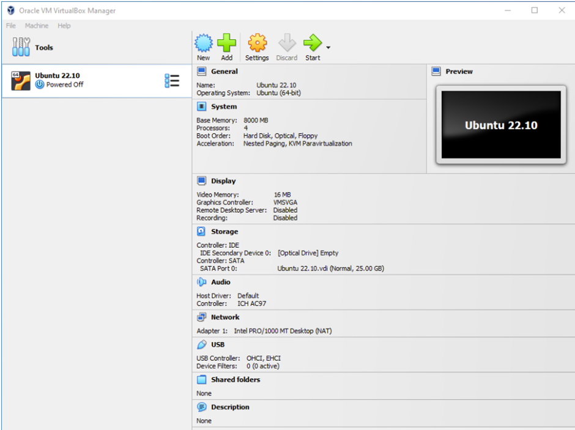
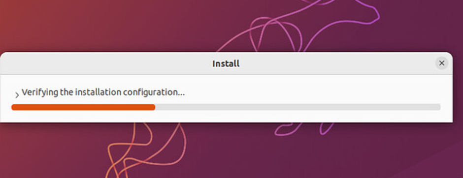
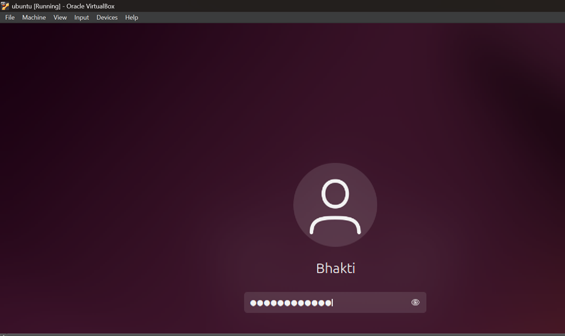

# LAB 0 - Ubuntu Installation

## ✅ Installation Method Chosen

- Method: **Virtual Machine** (or **Dual Boot**)  
- Reason: *(Write why you chose this method — e.g., easier setup, safety, performance, etc.)*

---

## 🖼️ Screenshots

### 1. Ubuntu Setup
)

### 2. Installation Progress

### 3. First Login

---

## 💻 Terminal Outputs

### ➤ `lsb_release -a`

#Q1 What are two advantages of installing Ubuntu in VirtualBox?
1. Safe Testing Environment
You can experiment with Ubuntu (or any Linux distribution) without affecting your main operating system. If something goes wrong, you can simply reset or delete the virtual machine.
•	Ideal for beginners learning Linux.
•	Great for testing software or configurations safely.

2. Multiple Operating Systems on One Machine
VirtualBox allows you to run Ubuntu alongside your existing OS (e.g., Windows or macOS) without needing to dual-boot.
•	No need to partition your hard drive.
•	You can switch between OSes seamlessly while working.

#Q2 What are two advantages of dual booting instead of using a VM?
1. Better Performance
When you dual boot, Ubuntu runs directly on your hardware, not inside another operating system.
•	Full access to CPU, RAM, and GPU (no virtualization overhead).
•	Ideal for tasks that require more resources, like programming, gaming, or video editing.
2. Access to Full Hardware Features
Some hardware features may not work properly or at all in a virtual machine (e.g., GPU acceleration, certain USB devices, or specific drivers).
•	Dual booting gives Ubuntu full control over hardware.
•	Better support for peripherals like Wi-Fi adapters, Bluetooth, and graphics cards.
