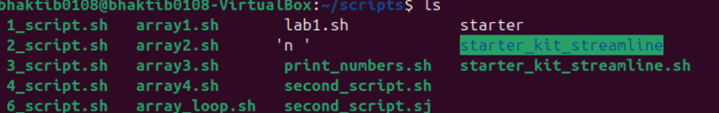
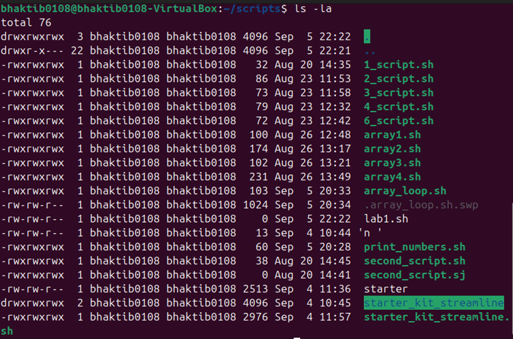
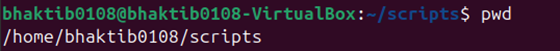
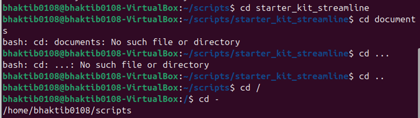
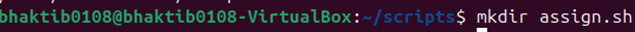
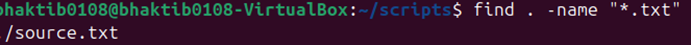

# LAB 1 – Linux Basics

## ✅ Lab Files Used:
- Lab3
- Lab5

---

## 🔧 Commands Executed and Explained

### 🔹 Command 1: `ls -l`
# Work of “ls” command – list directory contents

# ls -l detailed list 

# ls -a shows hidden files 

# ls -la combined 

# pwd – print working directory 

# cd – change directory 

# mkdir – makes a directory 

# touch – makes file
 
# copying of a folder 

# mv – move or rename files
 
# rm – remove files

# cat- view file content 

# nano – edits the particular file 

•	Ctrl+x – exits the file 
•	Ctrl+o – saves the file 
# clear – clear all the commands
•	Ctrl +  L

# echo – prints the text 

# whoami - shows the current user

# man – manual for any command 

•	Q to quit the page 
# find – locate files

# grep- find inside files

# to run multiple commands in one line 

QUESTIONS
Q1 What is the difference between chmod and chown?
Chmod- change mode 
•	Changes the permission for a file or a directory 
•	It implies on who can read, write or execute 
Chown – Changes the ownership 
•	Changes the ownership for a file or a directory 
•	It implies on who owns a file or which group owns it. 
Q2 How do you check current directory and user?
Ans
•	pwd – current directory 
•	whoami – tells the current user 
