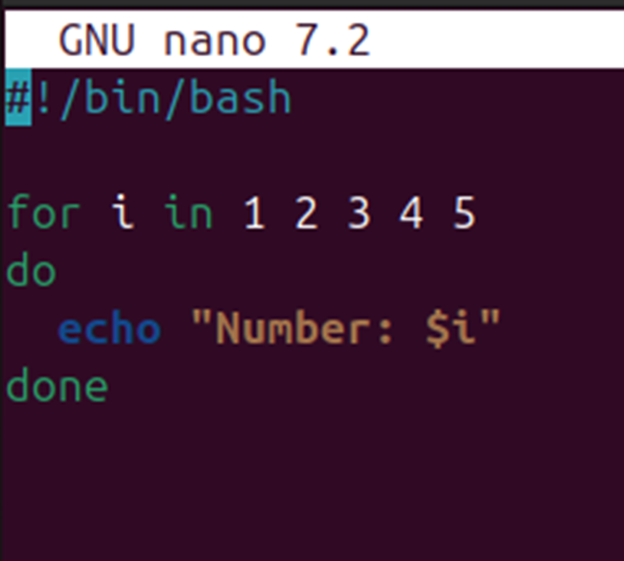
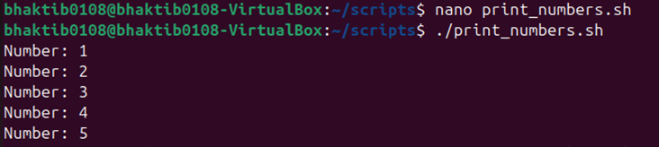
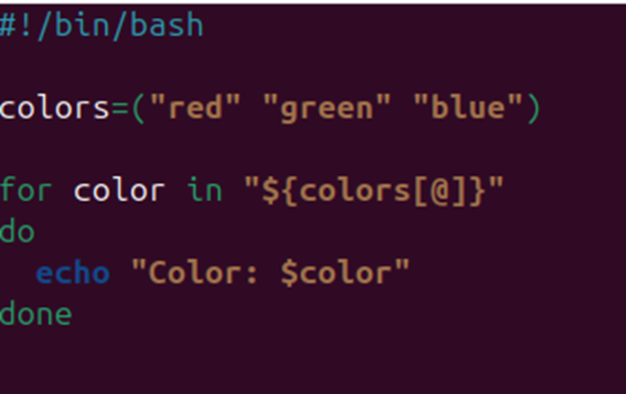
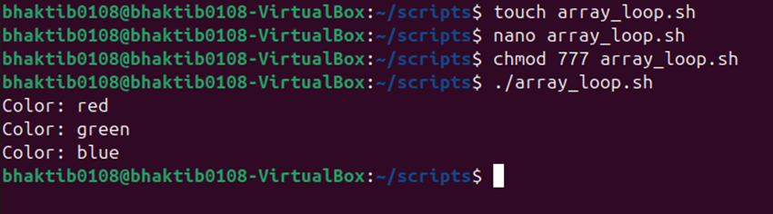

# LAB 2 – Script Execution & Explanation

## 📁 Script 1: `print_numbers.sh`

### 🔹 Purpose:
This script prints a list of numbers from 1 to 10 using a loop.

### 🔍 Line-by-Line Explanation:

```bash
#!/bin/bash
# Shebang tells the system to use Bash shell

for i in {1..10}
do
  echo $i
done

🔁 For loop starts
This line defines a loop that assigns values 1 to 5 to the variable i, one at a time in each iteration.
🟩 Start of loop block
Begins the block of code that will be executed for each value of i.
🟨 Print statement
Uses echo to display the current number.
$i is a variable, and its value changes with each iteration of the loop.
🟥 End of loop
Marks the end of the for loop block.
 ### OUTPUT:
 

 
 🟩 Array declaration
Creates an array named colors with three string elements: "red", "green", and "blue".
🔁 For loop over array
Loops through each element in the colors array.

${colors[@]} expands to all elements in the array.

"$color" will take one value at a time ("red", then "green", then "blue").

🟨 Start of loop block
Indicates the beginning of the block that will run for each value in the array.
🔚 End of loop
Ends the for loop.

### OUTPUT:


# Q1 What is the purpose of #!/bin/bash at the top of a script?
Ans It uses  bash shell to run  the script. 

# Q2 How do you make a script executable?
Ans To execute a certain script we use the command chmod. In the above screenshots I have even used, as we can see that I made a file by the name print_numbers.sh and to execute it we have to write (chmod 777 print_numbers.sh). 
