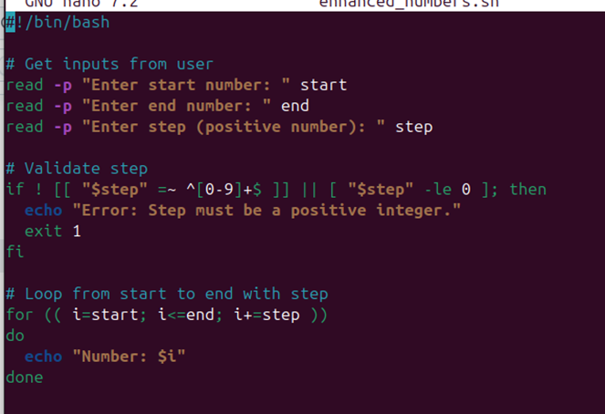
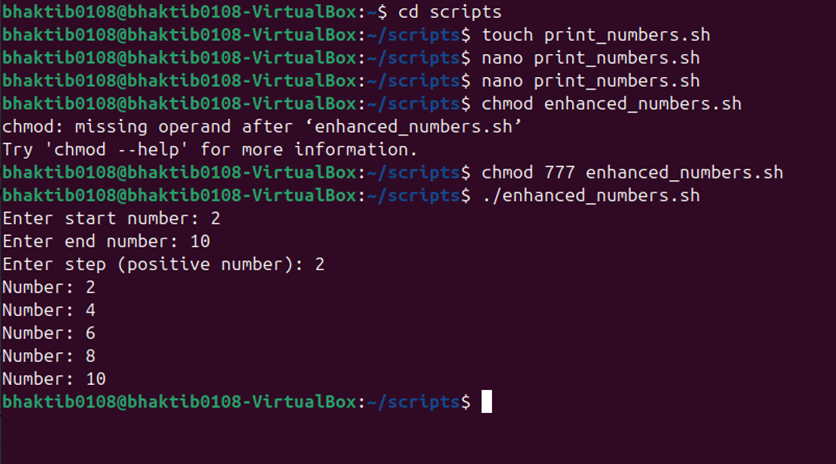

# LAB 3 – Enhanced Number Script

---

## 🧾 Original Behavior

### OUTPUT:

### Script: `print_numbers.sh`
- Printed numbers from 1 to 5 using a hardcoded `for` loop:
```bash
for i in 1 2 3 4 5
do
  echo "Number: $i"
done
