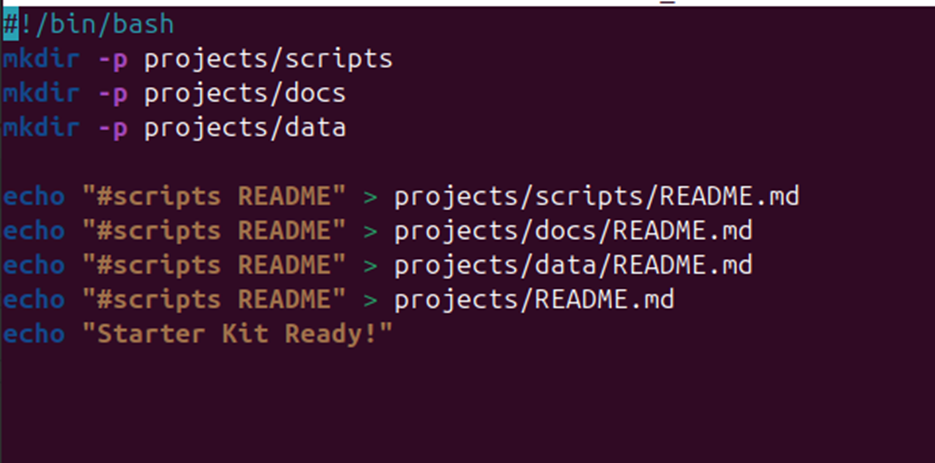
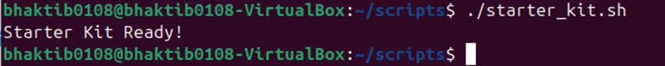

# 🧰 LAB4 – Starter Kit Script

## 🎯 Objective:
To automate the setup of a project directory with required folders and placeholder files using a Bash script.

---

## 📜 Script: `starter_kit.sh`

```bash
#!/bin/bash

# Create folder structure
mkdir -p project/scripts
mkdir -p project/docs
mkdir -p project/data



# Add placeholder README.md in each folder
echo "# Scripts Folder" > project/scripts/README.md
echo "# Documentation Folder" > project/docs/README.md
echo "# Data Folder" > project/data/README.md

# Final confirmation message
echo "Starter Kit Ready!"


```

# Purpose of the Script
The starter_kit.sh script automates the setup of a basic project directory structure by creating four main folders: project/, scripts/, docs/, and data/. It also adds a placeholder README.md file inside each folder to ensure they are not empty and ready for further content. Finally, it confirms completion by printing “Starter Kit Ready!”.

Q what does mkdir -p do?
A It makes an empty parent directory. 

Q why is automation useful in devops?
A Automation is useful in devops because:
   - consistency: tasks run in a same way, reducing errors. 
   - speed: faster builds, tests and deployments. 
   - Reliable: Less human errors, more stable system. 
