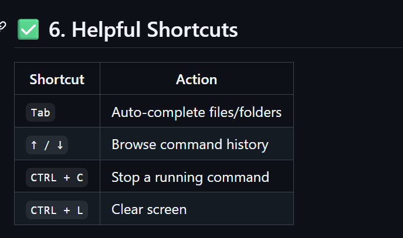

# Basic Commands 

```bash
# pwd- Print Working Directory
>> pwd
```

# ls- list directory content 
ls -1 Detailed list( permissions, size, date)
ls-a Shows hidden files (those starting with. 
ls -1a combined )

# cd- change directory 
cd folder_name

cd documents      # go to dpcument
cd ..             # go up one level 
cd /              # go to root
cd ~              # go to home directory 

##File and directory Management 
mkdir - Make Directory 
Creates a new folder 
mkdir new_folder

Touch - Create file 
Creates an empty file 
touch file.txt

cp - Copy Files or Directories 

cp source.txt destination.txt

* Copy Folder:
 cp -r folder1 folder2

 mv - Move or Rename Files
 mv oldname.txt newname.txt 

 mv file.txt ~/dpcument/ #Move file

 rm-  Remove Files
 rm file.txt # Delete file 
 rm -r folder_name # Delete folder (recursively)

 ### There is no undo! 

 File viewing and Editing 
 cat - View File Contents 
 Display content in terminal 
 cat file.txt 


nano - Edit Files in Terminal 

A basic terminal-based text editor. 
nano file.txt

* Use arrows to move 
* CTRL + 0 to save 
* CTRL + X to exit 

clear - Clears the Terminal

clear 
Shortcut: CTRL + L 

# System Commands 

echio - Print text

Useful for debugging or scripting 

echo "Hello, World!"

whoami - Show current user 

whoami

man- Manual for any command

man ls 

Use q to quit to the manual 

# Searching and Finding 
find - Locate files
find . name "*.txt"

+ Finds all .txt files in the current folder and subfolders 

grep - Search Inside Files 

grep "hello" file.txt

Searches for the word hello inside the file.txt

#Bonus: Chaining Command 

* Run multiple commands
mkdir test && cd test && touch hello.txt

* Run only if previous command succeeds: &&
* Run regardless of success: ;

// USE ./ TO UPLOAD AN IMAGE 



Q what does mkdir -p do?
A It makes an empty parent directory. 

Q why is automation useful in devops?
A Automation is useful in devops because:
   - consistency: tasks run in a same way, reducing errors. 
   - speed: faster builds, tests and deployments. 
   - Reliable: Less human errors, more stable system. 
